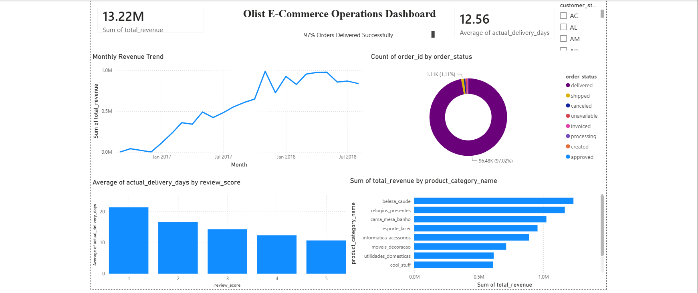
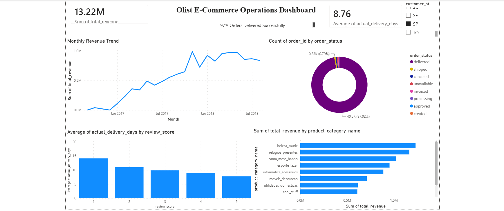

# Olist E-Commerce Operations Dashboard

## Highlights
- Analyzed ~99,000 orders across 9 linked tables using SQL (SQLite) — not just pandas
- Built an interactive Power BI dashboard with a working state-level filter
- Found delivery speed strongly predicts review score: 21.3 days avg for 1-star reviews vs. 10.7 days for 5-star reviews

## Business Problem
Is this e-commerce marketplace operationally healthy? Specifically: is revenue growing, are deliveries happening on time, does delivery speed affect customer satisfaction, and which product categories actually drive revenue?

## Dataset
Brazilian E-Commerce Public Dataset by Olist — Kaggle (https://www.kaggle.com/datasets/olistbr/brazilian-ecommerce)
~99,000 real orders (2016-2018), split across 9 relational tables (orders, order items, customers, products, payments, reviews, sellers, geolocation).

## What I Did
- Loaded 6 of the 9 tables into a SQLite database and wrote SQL queries with multi-table joins (instead of just merging in pandas, since this is closer to how real analyst teams work with relational data)
- Wrote SQL queries covering: monthly revenue trend, delivery performance (actual vs. estimated), delivery speed vs. review score, and top product categories by revenue
- Exported query results and built an interactive Power BI dashboard with KPI cards, 4 charts, and a state-level slicer/filter
- Verified the dashboard's filtering behavior updates all visuals live when selecting a state

## Key Insights

- Revenue grew steadily from late 2016 through 2018, with a sharp spike in November 2017 (likely Black Friday), followed by a plateau around R$0.8-1.0M/month.

- 97% of all orders reach "delivered" status successfully — a strong signal of overall marketplace reliability.

- Olist delivers in 12.6 days on average against a promised 23.7 days — a significant over-delivery buffer, with only 8.11% of orders arriving later than estimated.

- Delivery speed strongly predicts customer satisfaction: average delivery time drops steadily from 21.3 days for 1-star reviews to 10.7 days for 5-star reviews — a near-perfect monotonic relationship, suggesting delivery speed is one of the strongest levers for improving reviews.

- Health & Beauty leads total revenue (R$1.23M), but Watches & Gifts is notable for generating nearly as much revenue (R$1.17M) from far fewer orders — indicating a much higher average order value, likely a gifting/luxury category.

- The dashboard includes a state-level filter — selecting any Brazilian state instantly updates every chart and KPI to reflect that region's performance.

## PowerBi dashboard Link: https://summerfieldsco-my.sharepoint.com/:u:/g/personal/1122000569_sfsaryabhatta_com/IQC8eK3ocLyES5hjicXjjlW3ATRFDp_2m961HPlmvcObG3U?e=pMMdK1
## Tools
Python (pandas), SQL (SQLite, multi-table joins), Power BI Desktop — in Google Colab

## Notebook
Full SQL + analysis code: [olist_analysis.ipynb](olist_analysis.ipynb)

## Dashboard File
Power BI file: [olist_dashboard.pbix](olist_dashboard.pbix) (requires Power BI Desktop, free, to open)
